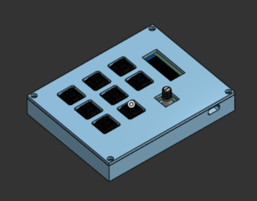
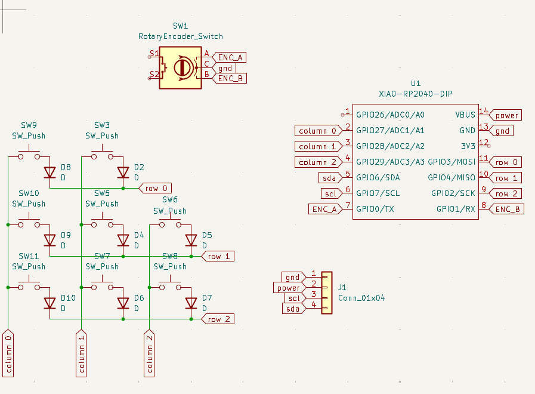
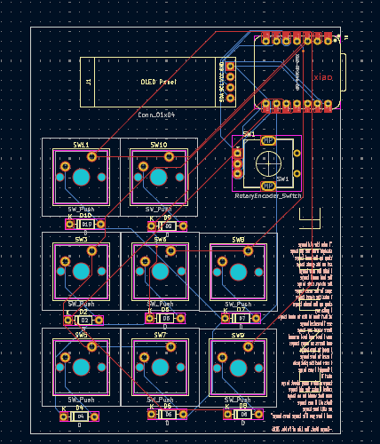
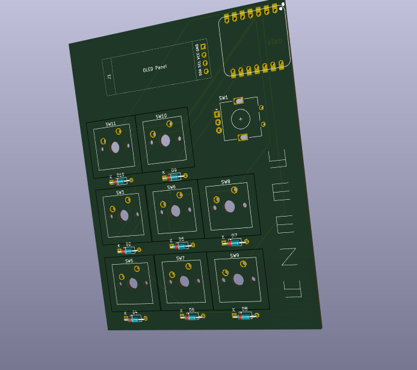
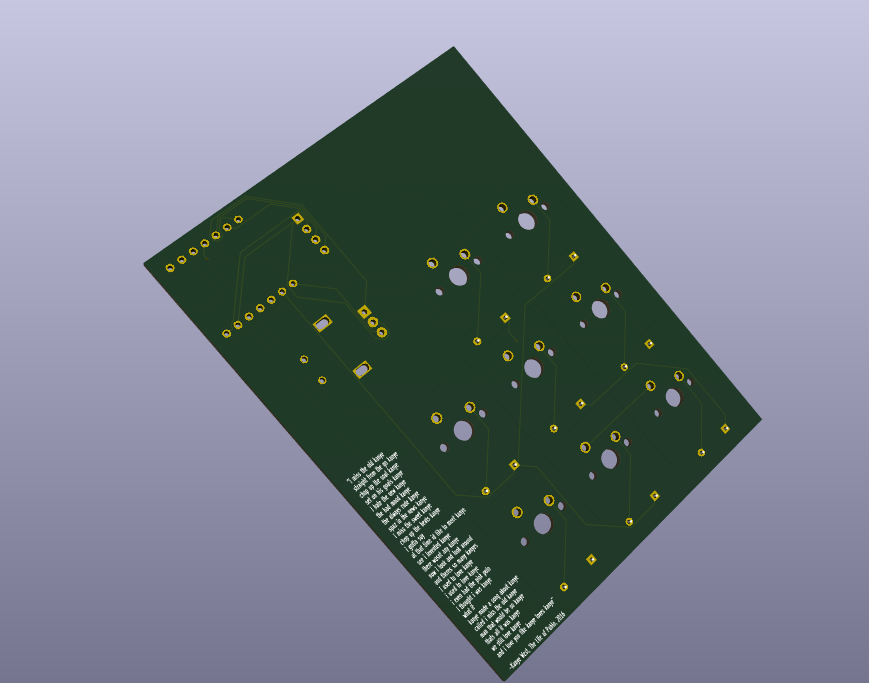

# set-on-his-goals-kanye
Presenting... The YEEZYPAD

this is my goofy case and model stuff for the PCB:

the function of this glorious macropad is to just have all my kanye related shortcuts on one macropad so that i can hopefully manifest the old kanye again

features: 

not much but i got a cool oled display!
also i have 8 keys and a rotary encoder

Everything in the cad model fits together with hopes and dreams, im gonna make a decent model as soon as i get the pcb my current one sucks

its also made in onshape (the greatest website of all time)

anyways heres the schematic:

and heres the other stuff

heres a pic from the front:

heres an actual 3d pic (back):

BOM:
1 cool pcb
a case with 2 3d printed parts (probably ABS or something cool)
8 DSA keycaps
1 EC11 rotary encoder
8 diodes
1 0.91 inch OLED display
1 XIAO rp2040
4 m3 heatset inserts
2 m3 bolts

anyways bye remember that kanye loves you like kanye loves kanye